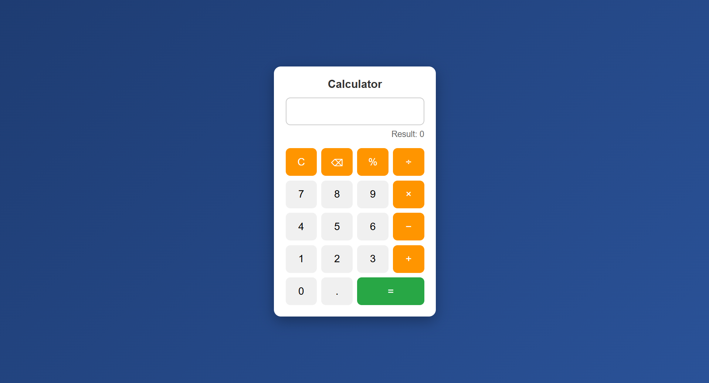

# 🖼️ Calculator

## Project Preview

(screenshot of output of code alpha-7 for frontend development.png)(screenshot of output of code alpha-8 for frontend development.png)(screenshot of output of code alpha-9 for frontend development.png)(screenshot of output of code alpha-10 for frontend development.png)

This project was developed as part of the CodeAlpha Frontend Development Internship.

## Features
- Basic Arithmetic Operations (+, -, ×, ÷)
- Interactive Calculator Interface
- Real-Time Result Display
- Clear Screen Functionality
- Responsive Design
- Keyboard Support
- Hover Effects and Styling Enhancements

## Technologies Used
- HTML
- CSS
- JavaScript

## Functionalities
- Addition
- Subtraction
- Multiplication
- Division
- Clear Display
- Keyboard Input Support

## Author
Gouru Sai Kowshik Reddy
